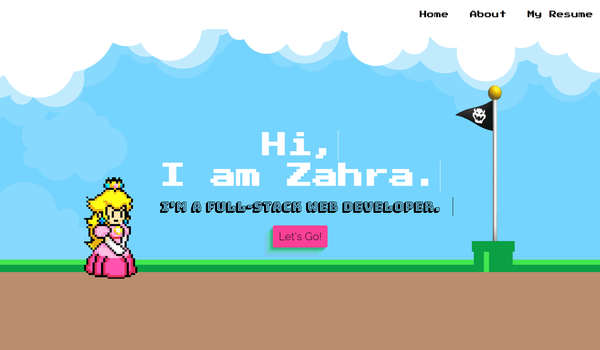

## General Information

The deployed Webpage is my Portfolio to showcase my work, introduce myself and give the user the posibility to contact through multiple channels such as LinkedIn, GitHub, Facebook or Email.

* [Deployed URL of my Portfolio](https://zahramertens.github.io/SupMaPortfolio/)
* [URL of the GitHub Repo](https://github.com/ZahraMertens/SupMaPortfolio.git)

## Table if Contents
1. [General Information](#general-informaion)
2. [Task Description](#task-description)
4. [Technology used](#technology-used)
5. [Mock-Up](#mock-up)
6. [Credits](#credits)

## Task Describtion

As a potential employer I want to get an impression of the developer to see project examples and contact information.

The portfolio is supposed to showcase the web developers skills and work that a potential employer or any other user can get an impression of the developers knowledge and qualifications. 

## Technology used

* HTML
* JavaScript
* CSS
* Google Fonts
* Getform.io
* ScrollMagic

**Note** In the future I'd like to exchange getform with php get method

## Mock-Up

The following GIF shows the web applications apperance and functionality:

## Credits

* https://www.w3schools.com/html/
* https://css-tricks.com/snippets/css/a-guide-to-flexbox/#flexbox-properties
* https://coding-boot-camp.github.io/full-stack/github/professional-readme-guide
* https://developer.mozilla.org/en-US/docs/Learn/CSS/Styling_text/Fundamentals
* https://css-tricks.com/snippets/css/style-links-depending-on-destination/
* https://htmlcheatsheet.com/css/
* https://www.w3schools.com/tags/att_a_download.asp

© 2021 Coding Bootcamp ,University of Sydney and Trilogy Education